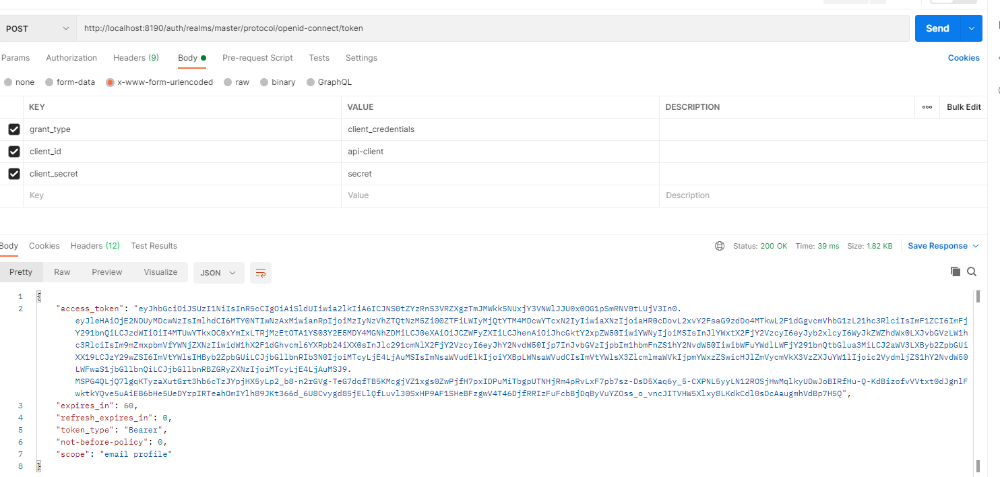

# quarkus-example Project
This project uses Quarkus, the Supersonic Subatomic Java Framework.
If you want to learn more about Quarkus, please visit its website: https://quarkus.io/ .

## To Run this in JVM mode on local, 
1. Please ask for the keycloak url and replace the value of `OIDC_AUTH_SERVER_URL` in `docker-compose.yaml`.
2. if you have maven run: `mvn clean package -Dquarkus.package.type=legacy-jar` after that just run the `docker-compose up` command.
3. if you don't have maven just uncomment line 8 and comment line#7 in Dockerfile and run `docker-compose up` command.

## To Run this in Native mode on local,
1. Please ask for the keycloak url and replace the value of `OIDC_AUTH_SERVER_URL` in `docker-compose-native.yaml`.
2. run ` docker-compose  -f docker-compose-native.yaml up --build`

_Once the 3 containers(app, postgres, keycloak) are running, you can access the keycloak at:
http://localhost:8190/auth
enter admin/admin as username and password.
create a client by uploading kc-client.json file in the root of this quarkus-example project.
now you can access the app swagger at:
http://localhost:8000/q/swagger-ui/
As it is secured with KC token , you can call token endpoint of KC to get a token and then pass it on to use API. Click on Authorize button on swagger UI and copy the token . The token expires in 5 minutes, so if 401 is returned , repeat the token fetch process_

Postman sample to get a token:

If you want to learn more about building native executables, please consult https://quarkus.io/guides/maven-tooling.

## Deployment to openshift
1. follow this link for artifactory knowledge https://developer.gov.bc.ca/Artifact-Repositories-(Artifactory),  it helps in understanding build and push of image to openshift.
2. Create secrets in GitHub
   1. This example repo has 3 secrets which are available for all deployments and then environment specific secrets are for each deployment.
      - `DOCKER_HUB_ACCESS_TOKEN`
      - `DOCKER_HUB_USERNAME`
      - `OPENSHIFT_SERVER`
   2. The quarkus-dev environment has secrets specific to this deployment.
      - `OPENSHIFT_TOKEN` The token to access openshift namespace where this will be deployed ex: `aaaaaa-dev`
      - `OIDC_AUTH_SERVER_URL` The URL of the Keycloak server
      - `NAMESPACE_NO_ENV` The namespace of the deployment ex: `aaaaaa`
3. Please refer to this file for sample openshift deployment. `.github/workflows/openshift-java-quarkus.yaml`
4. The image size produced is around 40 MB.
5. The application starts up within 4 seconds, with 10-25mc cpu and consumes around 35 Megs of memory.
6. The app consumes around .2mc cpu during idle time.

## Related Guides

- RESTEasy JAX-RS ([guide](https://quarkus.io/guides/rest-json)): REST endpoint framework implementing JAX-RS and more
- SmallRye Health ([guide](https://quarkus.io/guides/microprofile-health)): Monitor service health

## Provided Code

### RESTEasy JAX-RS

Easily start your RESTful Web Services

[Related guide section...](https://quarkus.io/guides/getting-started#the-jax-rs-resources)

### SmallRye Health

Monitor your application's health using SmallRye Health

[Related guide section...](https://quarkus.io/guides/smallrye-health)
